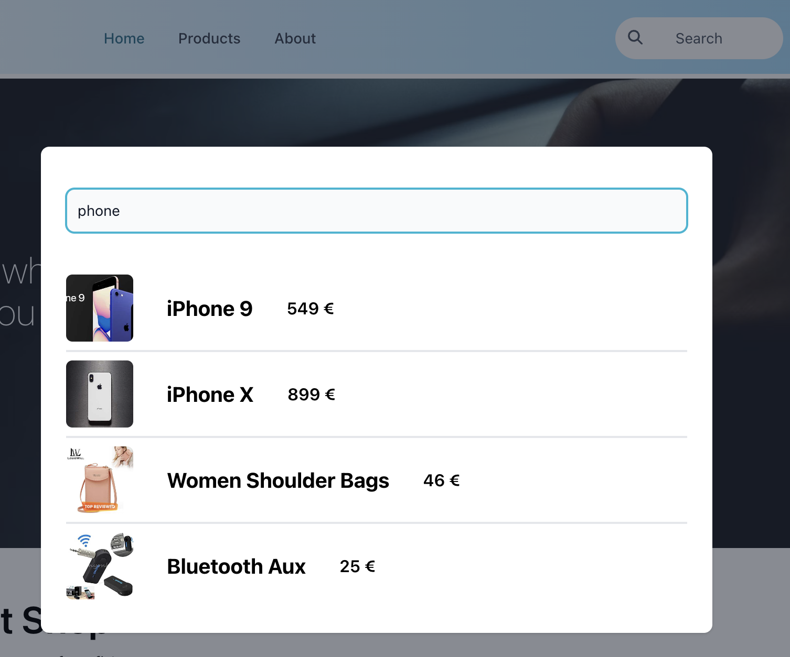

# Frontend project - Marmot Shop
This is a frontend demo website for e-commerce.

## Introduction
The marmot Shop is built using: 
- React for framework
- Typescript for programming language
- Redux for state management
- React Router Dom for router management
- TailwindCSS and flowbite for styling
- Dummyjson for demo API.

## Table of content
1. [Getting Started](#getting-started)
2. [Features](#features)
3. [Architecture & Design](#architecture--design)
4. [Testing](#testing)
5. [Deployment](#deployment)

## 1 Getting start
```
git clone https://github.com/yuankeMiao/marmot-shop.git
```
Then install the dependencies:
```
cd fs17-fe-project
npm install
```

To start the development server:
```
npm start
```

To deploy it:
```
npm run build
```

## 2 Features

### 2.1 Routers and pages
This project uses [react-router-dom](https://reactrouter.com/en/main) for the client side router control. 

Component `<Outlet>` is used in this app to provide a universal header and footer. All other pages are wrapped in.

This app also has a customized prtected router to check if the current user is allowed to visit a certain route.

### 2.2 For all viewers
Home page ('/'), all product page ('/all-product'), single product page('/product/:id), error page ('/*/**') are avaliable for all visitors. 

#### 2.2.1 Navigation
The header is sticky to the window, so it will be always on top the the window. Navbar has three items, it will highlight the active one.

#### 2.2.2 Search feature
This is a button in header, click this button will open a modal with a search input field, type any text in the search field, after 1s stop, it will show the result. Click anywhere  outside the modal to close the modal.



#### 2.2.3 Dark mode
The toggle button on header will toggle a whole app theme change via useContext and TailwindCSS. However, it is worth to note that, useContext hook is not nessesary in this case, because TaiwindCSS reads localStorage for theme info then toggle different mode. This project is using a simple useContext mainly because the requirements of this assignment.

The toggle button also change from a sun icon to a moon icon when the theme changes from light to dark.

#### 2.2.4 Cart
Even non-authorized users can use the cart to store the products they want to add. There is a cart icon with number badge in header to show how many items in the cart.

Click that icon will navigate to cart page, users can check the items in cart, change the amount of an item or delete it.

#### 2.2.5 Login & Register

### 2.3 For login users

### 2.4 For admin

### 2.5 User experience

### 2.6 Performance

### 2.7 Accessibility


## 3 Architecture & Design
### 3.1 Folder structure
```
.
├── App.tsx
├── appHooks
│   ├── reduxHooks.ts
│   ├── useFetchRandomQuote.ts
│   ├── useGetCurrentUser.ts
│   └── useThemeContext.tsx
├── components
│   ├── Footer.tsx
│   ├── Header.tsx
│   ├── MarmoteAnime.tsx
│   ├── admin
│   │   └── ProductManageForm.tsx
│   ├── produtcs
│   │   ├── AmountControl.tsx
│   │   ├── DisplayProducts.tsx
│   │   ├── Filters.tsx
│   │   ├── ProductCard.tsx
│   │   ├── ProductListItem.tsx
│   │   ├── Search.tsx
│   │   └── ShopAndFav.tsx
│   ├── skeleton
│   │   └── CardLoader.tsx
│   ├── user
│   │   ├── AddressTable.tsx
│   │   ├── Login.tsx
│   │   ├── LoginWithGoogle.tsx
│   │   ├── Register.tsx
│   │   └── UpdateForm.tsx
│   └── utils
│       ├── Bagde.tsx
│       ├── ScrollToTop.tsx
│       └── ToggleDarkMode.tsx
├── index.css
├── index.tsx
├── misc
│   ├── constants.ts
│   ├── errorTypes.ts
│   ├── productTypes.ts
│   ├── themeTypes.ts
│   └── userTypes.ts
├── pages
│   ├── AllProdutcsPage.tsx
│   ├── CartPage.tsx
│   ├── Dashboard.tsx
│   ├── ErrorPage.tsx
│   ├── HomePage.tsx
│   ├── Layout.tsx
│   ├── ProductPage.tsx
│   └── ProfilePage.tsx
├── react-app-env.d.ts
├── redux
│   ├── slices
│   │   ├── apiQuery.ts
│   │   ├── cartSlice.ts
│   │   ├── currentUserSlice.ts
│   │   └── userApi.ts
│   └── store.ts
├── reportWebVitals.ts
├── setupTests.ts
├── statics
│   └── marmot-1.png
└── test
    ├── reduxTest
    │   ├── cartSlice.test.ts
    │   ├── categoryQuery.test.ts
    │   ├── currentUserSlice.test.ts
    │   ├── productQuery.test.ts
    │   ├── search.test.ts
    │   └── userQuery.test.ts
    └── shared
        ├── cartServer.ts
        ├── productServer.ts
        └── userServer.ts
```
### 3.2 Redux structure

_If the text is too small, please check [here](https://app.wisemapping.com/c/maps/1682840/public) to zoom in._


### 3.3 Data flow and main components
- Symbol in this illustration: 
  - white: component
  - blue: reducer action
  - yellow: customized hook

_if the text is too small, please check [here](https://app.wisemapping.com/c/maps/1682877/public) to zoom in._


## 4 Testing

Tests are written with Jest and React Testing library, using msw for mock server.
There is three mock servers for products, cart and users.

 To run the tests and check the coverage:
```
npm test
```
Test result:


_Note: This project only tested redux logics, because some of the external libraries in components do not support the testing library._

## 5 Deployment
The Marmot Shop is deployed using Hostinger [here](https://marmotshop.yuankedev.fun/).