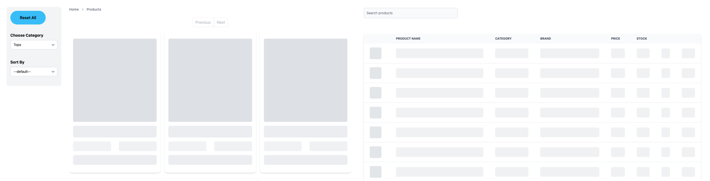
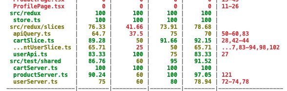

# Frontend project - Marmot Shop
This is a frontend demo website for e-commerce. It has a minimalist modern design, follwing modern websites's standard. Visit the live demo [here](https://marmotshop.yuankedev.fun).

## Introduction
The Marmot Shop is built using: 
- [React](https://react.dev/) for framework
- [Typescript](https://www.typescriptlang.org/) for programming language
- [Redux](https://redux.js.org/) for state management
- [React Router Dom](https://reactrouter.com/en/main) for router management
- [React Hook Form](https://react-hook-form.com/) for form control
- [TailwindCSS](https://tailwindcss.com/), [Flowbite](https://flowbite.com/), [Flowbite React](https://www.flowbite-react.com/) for styling
- [Dummyjson](https://dummyjson.com/) for demo API.

## Table of content
1. [Getting Started](#1-getting-started)
2. [Features](#2-features)
3. [Architecture & Design](#3-architecture--design)
4. [Testing](#4-testing)
5. [Deployment](#5-deployment)

## 1 Getting start
```
git clone https://github.com/yuankeMiao/marmot-shop.git
```
Then install the dependencies:
```
cd marmot-shop
npm install
```

To start the development server:
```
npm start
```

To deploy it:
```
npm run build
```
To use google login feature:

For security reason, Google login key is not pushed into Github, if you want to activate this feature in your local host, please follow this [instruction](https://developers.google.com/identity/sign-in/web/sign-in) to get your google login credential. Then, create a `.env` file, in the file, create a new enviroment variable ` REACT_APP_GOOGLE_CLIENT_ID` assigned with the credential. 

## 2 Features

### 2.1 Routers and pages
This project uses [react-router-dom](https://reactrouter.com/en/main) for the client side router control. 

Component `<Outlet>` is used in this app to provide a universal header and footer. All other pages are wrapped in.

### 2.2 For all viewers
Home page ('/'), all product page ('/all-product'), single product page('/product/:id), error page ('/*/**') are avaliable for all visitors. 


#### 2.2.1 Navigation
The header is sticky to the window, so it will be always on top the the window. Navbar has three items, it will highlight the active one.

#### 2.2.2 Search feature
This is a button in header, click this button will open a modal with a search input field, type any text in the search field, after 1s stop, it will show the result. Click anywhere  outside the modal to close the modal.


#### 2.2.3 Dark mode
The toggle button on header will toggle a whole app theme change via useContext and TailwindCSS. However, it is worth to note that, useContext hook is not nessesary in this case, because TaiwindCSS reads localStorage for theme info then toggle different mode. This project is using a simple useContext mainly because the requirements of this assignment.

The toggle button also change from a sun icon to a moon icon when the theme changes from light to dark.

#### 2.2.4 Cart
Even non-authorized users can use the cart to store the products they want to add. There is a cart icon with number badge in header to show how many items in the cart. If the total item amount is more than 99, it will show "...".

Click that icon will navigate to cart page, users can check the items in cart, change the amount of an item or delete it. User cannot changed the amount less than 1 or more than stock.

But this data is stored in redrx state, so if client reload the app, cart state will be reset to empty.

#### 2.2.5 All products page
This page has two main components: Filter and DisplayProducts. In Filter, user can select category and sort by price. It is worth to note that, we don't have a backend sorting query, so this sorting feature is a fake one purely done in frontend, so it will only sort the products on the current page.

#### 2.2.6 Amount control
In single priduct page and cart page, there is an amount control component, where user can increase, decrease or input the amount of product. If user input amount is more than stock, the amount will be set to the max avaliable number, and disable the buttom. There's also a tooltip to tell user the stock number.

#### 2.2.7 Login & Register
Since this app uses [DummmyJson](https://dummyjson.com) api for the data, we cannot change anuthong in the database, so the register will send user info to server, and receive a response. It means for this prototype website, we cannot login with the new user we just created.

For login, we can use Google login or the users already in DummyJson databse. For a full list of users, please check [here](https://dummyjson.com/users). Here's some login credentials you can use:
```
{
   // admin
   {
      "username": "atuny0",
      "password": "9uQFF1Lh",
   },

   // user
   {
      "username": "hbingley1",
      "password": "CQutx25i8r",
   },
   {
      "username": "rshawe2",
      "password": "OWsTbMUgFc",
   }
}
```

Since this api doesn't have refresh token endpoint, so app will pop up a modal to ask user to re-login when it noticed the token is expired. However, the app doesn't check the token constantly, it only check the token when user visit protected routes, or reload the whole app.

This app stores token in localStorage, so after user refresh the page, login status will be still valid.

### 2.3 For login users


#### 2.3.1 Cart
After user log into the app, it will trigger a reducer action immediately to fetch the cart data of this user from server (if capable), then merge the cart data to the local cart state. So the local cart state before user login will not lose. However, when client reload the whole app, cart data will be re-set to empty also.

#### 2.3.2 Profile
Authorized user will have avatar on the roght corner of header, instead of login/register button. Clicke the avatar will trigger a dropdown menu with current user's name and email, profile link, and logout button.

In profile page, user can check basic info, oerder info (always empty in this demo), adress, update the info, and logout. If user logout in profile page, it will show helper text to ask user login first.

#### 2.3.3 Logout
Logout reducer action will empty the user state to null, and remove the token in localStorage. Then trigger a reload of the page. So after logout, user's cart state will be empty also.

### 2.4 For admin
The database for users doesn't have a role property, so for the convenience, this app will recognized the user with id===1 as admin. And all other users including google login users, are all customers.

For admin user, the dropdown menu in avatar has another link: Dashboard. In Dashboard page, admin can create a new product, search for a product, update the info, and delete a product. And of course, for this demo, we just send the request to server, and receive a fake response. Then, user can have a feedback to know if the action is succeed or failed.


#### 2.4.1 Add new product
This feature is in a seperate modal, after added a product successfully, app will show a notification and allow admin continue adding more products or close the modal.

#### 2.4.2 Update product info
This feature is using the same component with add new product, but carrying value.

#### 2.4.3 Delete a product
This button will trigger a comfirmation modal first to confirm with the admin that if this product will be deleted. After confirmed, it will send delete request to server, and show correct status on the modal.

### 2.5 User experience
#### 2.5.1 Forms
This app has 5 forms, on top of the validation, all the input fields are using floating label, so the form is more campact and elegant. If an inpiut field failed with validation, the while outline will turn to red with help text, so user can easily know what to fill up.

For pruduct management forms, after the client reveived response from server, it shows a toast feedback next to the submit button. The color of toast indicates the response status.

#### 2.5.2 Scroll to Top
Whenever users navigate to a new page, the screen will automatically scroll to the top with a smooth behaviour.
There is also a scroll to top button in the right bottom corner, it is invisible when user is already on top, and show up when user scroll down more than 20px.

#### 2.5.3 Error page
If user get into an invalid route, like "/wrongpage", or"/product/nonexist". There will be a cute jumping marmot to tell users it is the wrong place, and provide a link to go back. Feel free to try it!

#### 2.5.4 Skeletons
Since the product data is the most important data in this app, so there is a skeleton component for the card. When loading is true, the page will render a nice looking pulsing skeleton in the same shape of real component.


#### 2.5.5 Feedbacks
User will receive feedbacks after an action is succeed or failed, like a toast message or loading button.

### 2.6 Optimazation
Lighthouse performance score for pages: 86 ~ 91.
#### 2.6.1 RTKQ
Redux tookit query provides efficient data fetching and caching to improve the performance. With the usage of provideTags and invalidateTags, the app can refetch data automatically when certain data updated. Lazy fetching provides another way to manually trigger a fetch like in the search feature.

#### 2.6.2 Caching functions and calculations
For array functions, the component will recreate a new one for every render, so it is better to cache some functions that barely change between re-renders. For this app, bounce function is cached by useCallback(), the calculation result in pagination feature is also cached by useMemo().

#### 2.6.3 Lazy loading
To improve the loading speed, this app uses lazy loading for images and iframes like the hero image in home page and embedded google map in profile page.

### 2.7 Accessibility
Lighthouse accessibility score for pages: 98 ~ 100.

This app is fully accessible for screen readers. All the buttons. inputs and links have proper descriptive contents or aria-labels. Meaningful HTML5 tags like `<header />`, `<footer />`, `<section />`, `<nav />`, `<main />`  are well used.

## 3 Architecture & Design
### 3.1 Folder structure
```
.
├── App.tsx
├── appHooks
│   ├── reduxHooks.ts
│   ├── useFetchRandomQuote.ts
│   ├── useGetCurrentUser.ts
│   ├── useLoginContext.tsx
│   └── useThemeContext.tsx
├── components
│   ├── Footer.tsx
│   ├── Header.tsx
│   ├── MarmoteAnime.tsx
│   ├── admin
│   │   ├── DeleteProduct.tsx
│   │   └── ProductManageForm.tsx
│   ├── produtcs
│   │   ├── AmountControl.tsx
│   │   ├── DisplayProducts.tsx
│   │   ├── Filters.tsx
│   │   ├── ProductCard.tsx
│   │   ├── ProductListItem.tsx
│   │   ├── Search.tsx
│   │   └── ShopButton.tsx
│   ├── skeleton
│   │   ├── CardLoader.tsx
│   │   └── TableItemLoader.tsx
│   ├── user
│   │   ├── AddressTable.tsx
│   │   ├── Login.tsx
│   │   ├── LoginWithGoogle.tsx
│   │   ├── Register.tsx
│   │   └── UpdateForm.tsx
│   └── utils
│       ├── Bagde.tsx
│       ├── ScrollToTop.tsx
│       ├── ScrolltoTopButton.tsx
│       └── ToggleDarkMode.tsx
├── index.css
├── index.tsx
├── misc
│   ├── constants.ts
│   ├── errorTypes.ts
│   ├── productTypes.ts
│   ├── themeTypes.ts
│   └── userTypes.ts
├── pages
│   ├── AllProdutcsPage.tsx
│   ├── CartPage.tsx
│   ├── Dashboard.tsx
│   ├── ErrorPage.tsx
│   ├── HomePage.tsx
│   ├── Layout.tsx
│   ├── ProductPage.tsx
│   └── ProfilePage.tsx
├── react-app-env.d.ts
├── redux
│   ├── slices
│   │   ├── apiQuery.ts
│   │   ├── cartSlice.ts
│   │   ├── currentUserSlice.ts
│   │   └── userApi.ts
│   └── store.ts
├── reportWebVitals.ts
├── setupTests.ts
├── statics
│   ├── hero-img.webp
│   └── marmot-1.png
└── test
    ├── reduxTest
    │   ├── cartSlice.test.ts
    │   ├── categoryQuery.test.ts
    │   ├── currentUserSlice.test.ts
    │   ├── productQuery.test.ts
    │   ├── search.test.ts
    │   └── userQuery.test.ts
    └── shared
        ├── cartServer.ts
        ├── productServer.ts
        └── userServer.ts
```
### 3.2 Redux structure

_If the text is too small, please check [here](https://app.wisemapping.com/c/maps/1682840/public) to zoom in._


### 3.3 Data flow and main components
- Symbol in this illustration: 
  - white: component
  - blue: reducer action
  - yellow: customized hook

_if the text is too small, please check [here](https://app.wisemapping.com/c/maps/1682877/public) to zoom in._


## 4 Testing

Tests are written with Jest and React Testing library, using msw for mock server.
There is three mock servers for products, cart and users.

 To run the tests and check the coverage:
```
npm test
```
Test result:


_Note: This project only tested redux logics, because some of the external libraries in components do not support the testing library._

## 5 Deployment
The Marmot Shop is deployed using [Hostinger](https://www.hostinger.com/).

You can view the live demo [here](https://marmot-shop-whst4vikj-marmotte-gos-projects.vercel.app).